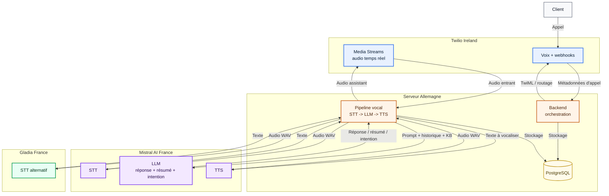
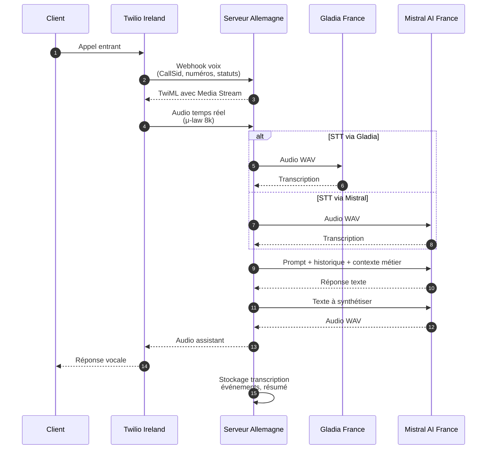
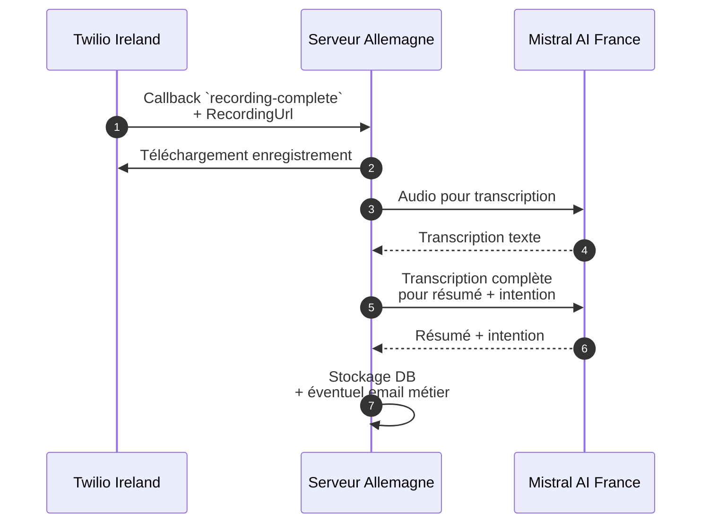
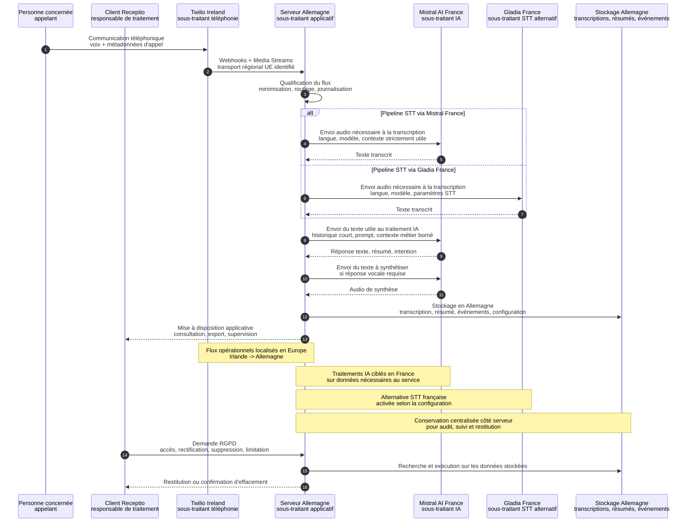
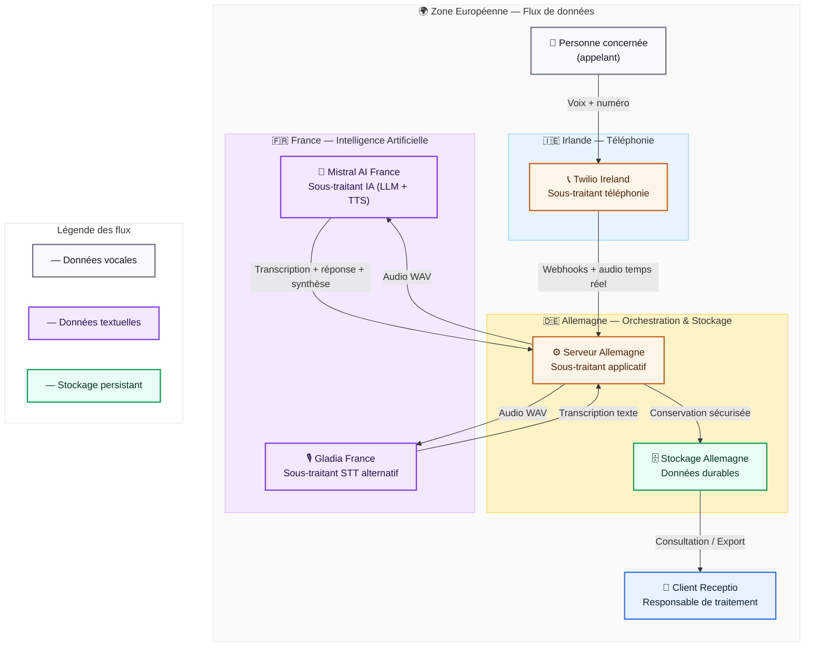
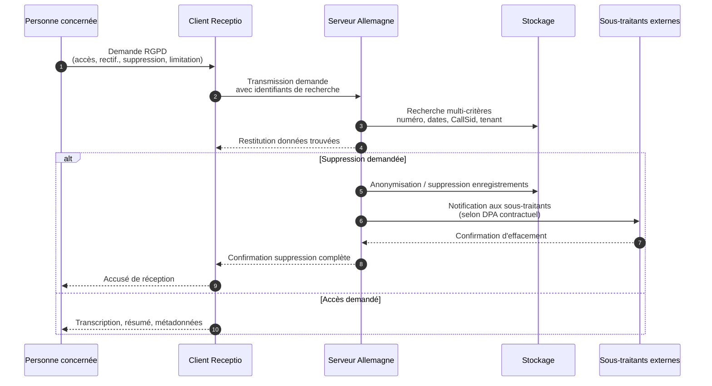

# Schéma de transit des données

## Vue d’ensemble

## Légende rapide

- **Bleu**
  - Twilio Ireland

- **Orange**
  - Serveur principal en Allemagne

- **Violet**
  - Mistral AI en France

- **Vert**
  - Gladia en France

## Flux détaillés

### 1. Appel entrant temps réel

### 2. Messagerie / fallback / post-traitement

## Ce qui transite concrètement

- **Twilio Ireland <-> Serveur Allemagne**
  - audio téléphonique temps réel
  - métadonnées d'appel
  - identifiants Twilio (`CallSid`, `StreamSid`)
  - URL d'enregistrement et callbacks de statut

- **Serveur Allemagne -> Mistral AI France**
  - audio converti en `wav` pour transcription
  - historique conversationnel court
  - prompt système
  - contexte métier / base de connaissances injectée
  - texte à synthétiser pour TTS
  - transcription complète pour résumé / intention

- **Serveur Allemagne -> Gladia France**
  - audio converti en `wav`
  - langue
  - paramètres de transcription

- **Serveur Allemagne**
  - persiste transcriptions, résumés, événements d'appel, configuration entreprise
  - orchestre les choix de pipeline : `Twilio -> STT -> LLM -> TTS -> Twilio`

## Lecture rapide

- **Twilio Ireland**
  - point d’entrée téléphonique
  - transporte l’audio et déclenche les webhooks

- **Mistral AI France**
  - transcription possible
  - génération de réponse
  - synthèse vocale
  - résumé et détection d’intention

- **Gladia France**
  - transcription alternative en temps réel / différé selon configuration

- **Serveur Allemagne**
  - point central de transit
  - conversion audio
  - orchestration logique
  - stockage des données applicatives

## RGPD et souveraineté européenne

### Sequence diagram

### Lecture technique

- **Responsable de traitement**
  - le client utilisateur de la plateforme reste le **responsable de traitement** des données d'appel
  - la plateforme, Twilio, Mistral et Gladia interviennent comme **sous-traitants** ou sous-traitants ultérieurs selon la chaîne contractuelle

- **Principe de minimisation**
  - le serveur en Allemagne agit comme point de contrôle
  - il ne transmet aux briques IA que les données nécessaires au traitement demandé :
    - audio utile au STT
    - historique court
    - contexte métier borné
    - texte à synthétiser

- **Confinement géographique des flux**
  - téléphonie : `Twilio Ireland`
  - orchestration et stockage applicatif : `Serveur Allemagne`
  - IA générative et TTS : `Mistral AI France`
  - STT alternatif : `Gladia France`

- **Souveraineté opérationnelle**
  - le point de maîtrise principal est le serveur en Allemagne
  - c’est lui qui décide :
    - quel fournisseur reçoit quoi
    - à quel moment
    - pour quelle finalité
    - ce qui est conservé ou non en base

- **Stockage persistant**
  - les données applicatives durables sont regroupées côté stockage en Allemagne
  - cela couvre notamment :
    - transcription
    - résumé
    - événements d'appel
    - configuration entreprise

- **Droits RGPD**
  - les demandes d'accès, de suppression ou de rectification passent par l’application
  - la mise en œuvre technique s’opère depuis le serveur central vers la base de données
  - selon les engagements contractuels des sous-traitants, une suppression étendue peut aussi devoir être propagée chez les fournisseurs externes si des données y sont conservées

### Point d’attention juridique

- **À confirmer contractuellement**
  - la seule localisation technique visible dans le code ne suffit pas à démontrer à elle seule la conformité complète
  - pour une documentation RGPD formelle, il faut aussi vérifier :
    - DPA / accord de sous-traitance
    - durées de conservation réelles chez chaque fournisseur
    - sous-traitants ultérieurs
    - mécanismes de suppression
    - mesures de sécurité et journalisation

---

## Documentation DPO-ready

### 1. Base légale et finalités

| Finalité | Base légale | Données concernées | Justification |
|----------|-------------|-------------------|---------------|
| **Réponse automatique aux appels** | Exécution du contrat (art. 6.1.b RGPD) | Voix, numéro d'appel, métadonnées techniques | Service de réception téléphonique automatisé demandé par le client |
| **Transcription et résumé** | Exécution du contrat / Intérêt légitime (art. 6.1.b/f) | Contenu audio, transcription textuelle, intention détectée | Restitution au client pour suivi qualité et documentation |
| **Supervision et qualité** | Intérêt légitime (art. 6.1.f) | Événements d'appel, durées, statuts | Amélioration du service, détection d'anomalies |
| **Exercice des droits RGPD** | Obligation légale / Exécution du contrat | Identifiants techniques, logs de traitement | Réponse aux demandes d'accès, rectification, suppression |

### 2. Catégories de données et criticité

| Catégorie | Nature | Niveau de sensibilité | Justification |
|-----------|--------|----------------------|---------------|
| **Données d'identification** | Numéro d'appel, CallSid, StreamSid | **Standard** | Identifiants techniques nécessaires au routage |
| **Données biométriques** | Voix (biométrie indirecte) | **Élevé** | Données biométriques au sens large (directive UE 2016/680) |
| **Données de contenu** | Transcription textuelle, résumé | **Élevé** | Contenu potentiellement sensible de la communication |
| **Données de comportement** | Événements, durées, intentions | **Standard** | Métriques de service sans contenu sémantique |

### 3. Schéma de flux DPO-ready

### 4. Durées de conservation

| Type de donnée | Durée de conservation | Justification | Mécanisme de suppression |
|----------------|----------------------|---------------|-------------------------|
| **Enregistrements audio temporaires** | Durée du traitement uniquement (quelques secondes à minutes) | Nécessité technique immédiate, pas de stockage persistant des fichiers audio bruts | Suppression automatique post-traitement |
| **Transcriptions textuelles** | Durée contractuelle avec le client (typiquement 12 à 36 mois selon secteur) | Obligation légale sectorielle / archivage métier | Suppression programmée ou sur demande |
| **Résumés et intentions** | Identique aux transcriptions | Traçabilité et restitution | Suppression en cascade avec transcriptions |
| **Événements d'appel (métadonnées)** | 24 à 36 mois | Analyse de qualité, facturation, litiges | Archivage puis suppression automatique |
| **Logs techniques RGPD** | 36 mois maximum | Exercice des droits, sécurité, traçabilité | Rotation automatique |

### 5. Mesures techniques et organisationnelles (MTD)

#### Chiffrement

| Élément | Mesure | Justification |
|---------|--------|---------------|
| **Données en transit** | TLS 1.3 pour tous les flux HTTP/WebSocket | Confidentialité des échanges inter-services |
| **Données au repos** | Chiffrement AES-256 côté base de données | Protection en cas d'accès physique non autorisé |
| **Clés API** | Stockage variables d'environnement, rotation régulière | Sécurité des accès aux sous-traitants |

#### Pseudonymisation / Minimisation

| Mesure | Implémentation | Efficacité |
|--------|---------------|------------|
| **Identifiants techniques** | CallSid, StreamSid générés par Twilio | Dissociation de l'identité réelle |
| **Historique conversationnel** | Limitation à N messages (actuellement 12) | Réduction de l'empreinte de données |
| **Contexte KB** | Sélection top 3-5 chunks maximum | Minimisation du contexte métier injecté |
| **Filtrage intentionnel** | Bypass KB sur salutations / small talk | Évitement de requêtes inutiles |

#### Contrôle d'accès

| Niveau | Mesure |
|--------|--------|
| **Authentification** | JWT avec expiration courte (15-60 min) |
| **Autorisation** | RBAC (Role-Based Access Control) par tenant |
| **Audit** | Journalisation des accès aux données sensibles |
| **Segregation** | Isolation des données par entreprise (company_id) |

#### Resilience et sécurité opérationnelle

| Menace | Contre-mesure |
|--------|---------------|
| **Fuite chez sous-traitant** | DPA contractualisé, audits réguliers, clauses de destruction |
| **Accès non autorisé serveur** | Hardening, firewall, monitoring, patching |
| **Injection dans prompts** | Validation des entrées, échappement, contexte borné |
| **Rétention excessive** | TTL automatique, politiques de rétention configurables |

### 6. Exercice des droits - Processus détaillé

### 7. Registre des traitements - Synthèse

| Élément | Détail |
|---------|--------|
| **Référence** | Traitement-RECEPTIO-001 : Gestion des appels téléphoniques automatisée |
| **Responsable** | Client utilisateur de la plateforme (par délégation Receptio en tant que sous-traitant applicatif) |
| **DPO désigné** | À confirmer selon structure du client |
| **Sous-traitants** | Twilio Ireland, Mistral AI France, Gladia France, Hébergeur serveur Allemagne |
| **Pays tiers** | Aucun dans la chaîne actuelle (100% UE : IE, DE, FR) |
| **Garanties** | DPA signés, SCC si nécessaire, certification ISO 27001 à vérifier chez chaque fournisseur |

### 8. Points de vigilance pour le DPO

| Risque | Évaluation | Mesures complémentaires recommandées |
|--------|-----------|-----------------------------------|
| **Voix comme donnée biométrique** | Risque élevé si réutilisation abusive | Désactivation possible du stockage audio brut, rétention transcription uniquement |
| **IA générative et hallucinations** | Risque modéré de données incorrectes | Validation humaine possible, marquage "généré par IA" |
| **Sous-traitants ultérieurs** | Risque modéré si cascade non maîtrisée | Mapping complet de la chaîne, vérification DPA en cascade |
| **Portabilité des données** | Risque faible mais à prévoir | Export structuré (JSON/CSV) des transcriptions et résumés |
| **Transferts futurs hors UE** | Risque à anticiper | Clauses contractuelles de non-transfert sans notification |
